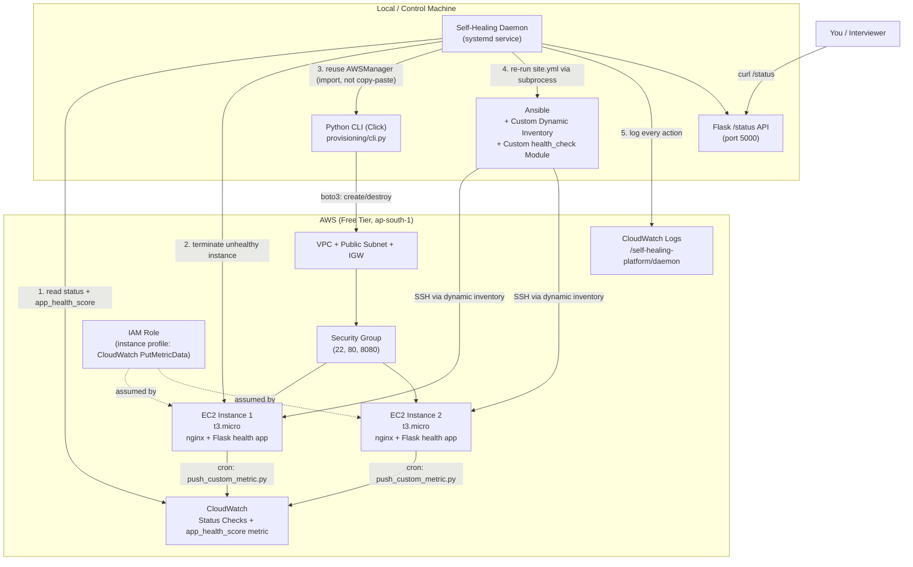
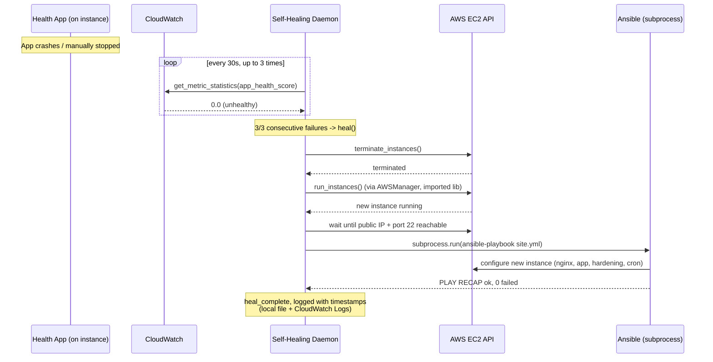

# Self-Healing AWS Infrastructure Automation Platform

A Python-based automation platform that provisions AWS infrastructure with **pure boto3** (no Terraform/CloudFormation), configures it with **Ansible** (including a hand-written custom module), continuously monitors it with **CloudWatch**, and **automatically detects, terminates, and replaces unhealthy EC2 instances** — all orchestrated by a Python daemon, running entirely within the AWS Free Tier.

> Built to answer, with a real story: *"Have you worked with Python / Ansible / self-healing automation?"*

---

## Table of Contents

- [Architecture](#architecture)
- [Tech Stack](#tech-stack)
- [Repository Structure](#repository-structure)
- [Free-Tier Safety Policy](#free-tier-safety-policy)
- [Part A — Infrastructure Provisioning (boto3)](#part-a--infrastructure-provisioning-boto3)
- [Part B — Configuration Management (Ansible)](#part-b--configuration-management-ansible)
- [Part C — Monitoring (CloudWatch)](#part-c--monitoring-cloudwatch)
- [Part D — Self-Healing Daemon](#part-d--self-healing-daemon)
- [Mandatory Failure Test — Evidence](#mandatory-failure-test--evidence)
- [Bugs Found & Fixed](#bugs-found--fixed-during-real-testing)
- [Cleanup](#cleanup)
- [Interview Talking Points](#interview-talking-points)

---

## Architecture



### Self-healing sequence (what happens on failure)



---

## Tech Stack

| Layer | Tools |
|---|---|
| Language / CLI | Python 3, Click, Flask, Paramiko |
| Infra Provisioning | boto3 (EC2, VPC, Security Groups, IAM) — no Terraform/CloudFormation |
| Config Management | Ansible, custom dynamic inventory, custom Python module |
| Monitoring | CloudWatch (metrics, status checks, Logs) |
| OS | Ubuntu 22.04 (EC2 AMI), systemd, logrotate |
| Instance size | t3.micro only (Free Tier eligible in `ap-south-1`) |

---

## Repository Structure

```
self-healing-aws-platform/
├── provisioning/           # Part A - boto3 CLI
│   ├── config.py           # Free-tier guardrails, tags, naming
│   ├── aws_manager.py       # Idempotent VPC/Subnet/SG/EC2 create+destroy
│   └── cli.py               # Click CLI: up / destroy / status
├── ansible/                 # Part B - Configuration management
│   ├── ansible.cfg
│   ├── inventory/aws_ec2_dynamic.py   # Custom boto3-based dynamic inventory
│   ├── library/health_check.py        # Custom Ansible module
│   └── playbooks/
│       ├── site.yml                   # Master playbook
│       ├── 01_base_setup.yml          # User creation + SSH hardening
│       ├── 02_nginx_app.yml           # nginx + Flask health app
│       ├── 03_logrotate.yml           # Log rotation
│       └── 05_deploy_metrics_push.yml # CloudWatch metric push + cron
├── monitoring/               # Part C - CloudWatch
│   ├── cloudwatch_reader.py           # CPU/status check reader
│   ├── push_custom_metric.py          # Runs on instance, pushes app_health_score
│   └── setup_iam_role.py              # IAM role + instance profile setup
├── daemon/                    # Part D - Self-healing daemon
│   ├── healer.py             # Core health-check + heal logic
│   ├── api.py                # Flask /status endpoint
│   ├── main.py                # Entrypoint (systemd target)
│   ├── logging_config.py     # RotatingFileHandler + JSON formatter
│   └── cw_logs.py             # CloudWatch Logs pusher
├── systemd/self-healing-daemon.service
├── logrotate/self-healing-daemon
├── docs/
│   ├── custom_ansible_module.md      # Why a custom module was needed
│   └── failure_test_evidence.md      # Timestamped proof of self-healing
└── README.md
```

---

## Free-Tier Safety Policy

- Billing alarm ($1 threshold, AWS Budgets) created **before** any resource was provisioned.
- Instance type hard-locked to `t3.micro` in code (`config.validate_instance_type`) — the CLI refuses anything else.
- No Elastic IP ever allocated — public subnet auto-assigns a public IP.
- No NAT Gateway anywhere in the design.
- Exactly **one** custom CloudWatch metric (`app_health_score`) — well under the free 10-metric limit.
- `python -m provisioning.cli destroy` run at the end of every session.

---

## Part A — Infrastructure Provisioning (boto3)

A Click-based CLI that replaces what Terraform would normally do — written by hand so the underlying mechanics (idempotency, tagging, dependency-ordered teardown) are fully understood.

### Setup

```bash
python3 -m venv .venv
source .venv/bin/activate
pip install -r requirements.txt
aws configure   # region: ap-south-1
```

### Provision infrastructure (idempotent)

```bash
python -m provisioning.cli up --key-name self-healing-key
```

**Result:**
```
2026-09-15 14:36:54 [INFO] Created VPC vpc-01051afe6132267a2 with IGW igw-0d48e43763622b41e
2026-09-15 14:36:56 [INFO] Created subnet subnet-0825a3f1e56f481de (public, routed to IGW)
2026-09-15 14:36:57 [INFO] Created security group sg-05c5b369da6bd1bf4
2026-09-15 14:36:59 [INFO] Launched instance i-04652f165ceadef4e (self-healing-platform-node-1)
2026-09-15 14:37:00 [INFO] Launched instance i-0327f90d66adaaebc (self-healing-platform-node-2)

--- Provisioning result ---
vpc_id: vpc-01051afe6132267a2
subnet_id: subnet-0825a3f1e56f481de
sg_id: sg-05c5b369da6bd1bf4
instance_ids: ['i-04652f165ceadef4e', 'i-0327f90d66adaaebc']
```

### Idempotency proof — re-running creates nothing new

```bash
python -m provisioning.cli up --key-name self-healing-key
```

**Result:**
```
[INFO] VPC already exists: vpc-01051afe6132267a2
[INFO] Subnet already exists: subnet-0825a3f1e56f481de
[INFO] Security group already exists: sg-05c5b369da6bd1bf4
[INFO] 2 instance(s) already running, skipping create.
```

### Check status / destroy

```bash
python -m provisioning.cli status
python -m provisioning.cli destroy      # tears down in correct dependency order
python -m provisioning.cli up --dry-run --key-name x   # preview without calling AWS
```

**Destroy result:**
```
[INFO] Terminated instances: [...]
[INFO] Deleted security group sg-...
[INFO] Deleted subnet subnet-...
[INFO] Deleted IGW igw-...
[INFO] Deleted route table rtb-...
[INFO] Deleted VPC vpc-...
Destroy complete.
```

---

## Part B — Configuration Management (Ansible)

### Custom dynamic inventory

`ansible/inventory/aws_ec2_dynamic.py` queries AWS live via boto3 for running, tagged EC2 instances and emits Ansible's expected JSON inventory format — no static hosts file.

```bash
python ansible/inventory/aws_ec2_dynamic.py --list
```

**Result (abridged):**
```json
{
  "self_healing_nodes": { "hosts": ["self-healing-platform-node-1", "self-healing-platform-node-2"] },
  "_meta": {
    "hostvars": {
      "self-healing-platform-node-1": { "ansible_host": "15.207.16.229", "instance_id": "i-04652f165ceadef4e" },
      "self-healing-platform-node-2": { "ansible_host": "13.235.68.58",  "instance_id": "i-0327f90d66adaaebc" }
    }
  }
}
```

### Connectivity test

```bash
cd ansible
ansible self_healing_nodes -m ping
```

**Result:**
```
self-healing-platform-node-1 | SUCCESS => { "changed": false, "ping": "pong" }
self-healing-platform-node-2 | SUCCESS => { "changed": false, "ping": "pong" }
```

### Run full configuration

```bash
ansible-playbook playbooks/site.yml
```

Installs: dedicated non-root app user, SSH hardening (no root login, key-only auth), nginx reverse proxy, a Flask health app (`/health`) under systemd, logrotate for app logs, and the CloudWatch metric push cron job.

**Result:**
```
PLAY RECAP
self-healing-platform-node-1 : ok=26  changed=2  unreachable=0  failed=0
self-healing-platform-node-2 : ok=26  changed=2  unreachable=0  failed=0
```

Verify:
```bash
curl http://<instance-ip>/health
# {"hostname":"ip-10-20-1-65","status":"ok","uptime_seconds":58.51}

ssh -i ~/.ssh/self-healing-key.pem root@<instance-ip>
# root@...: Permission denied (publickey)   <- proves SSH hardening works
```

### Custom Ansible module — `health_check`

Written in Python, follows the real module contract: JSON in via `AnsibleModule`, JSON out with `changed`/`failed`. Checks an HTTP health endpoint and returns **structured** status — HTTP code, precise response time, and specific fields extracted from the JSON payload — something the generic `uri` module can only partially do (see [`docs/custom_ansible_module.md`](docs/custom_ansible_module.md) for the full write-up).

```bash
ansible-playbook playbooks/04_health_check_test.yml
```

**Result:**
```json
{
  "healthy": true,
  "http_code": 200,
  "response_time_ms": 3.07,
  "payload": {"hostname": "ip-10-20-1-65", "status": "ok", "uptime_seconds": 952.78},
  "reason": "ok"
}
```

---

## Part C — Monitoring (CloudWatch)

### Read built-in EC2 metrics (control machine)

```bash
python monitoring/cloudwatch_reader.py
```

**Result:**
```
self-healing-platform-node-2  i-0327f90d66adaaebc  CPU=0.10%  InstanceStatus=ok  SystemStatus=ok
self-healing-platform-node-1  i-04652f165ceadef4e  CPU=0.10%  InstanceStatus=ok  SystemStatus=ok
```

### Push a custom metric from inside each instance

`monitoring/push_custom_metric.py` runs on the instance itself (deployed + scheduled via cron by Ansible), reads the local `/health` endpoint, and pushes exactly **one** custom metric — `app_health_score` — to CloudWatch, authenticated via an **IAM instance role** (no embedded credentials).

```bash
aws cloudwatch list-metrics --namespace SelfHealingPlatform
```

**Result:**
```json
{
  "Metrics": [
    {"Namespace": "SelfHealingPlatform", "MetricName": "app_health_score",
     "Dimensions": [{"Name": "InstanceId", "Value": "i-04652f165ceadef4e"}]},
    {"Namespace": "SelfHealingPlatform", "MetricName": "app_health_score",
     "Dimensions": [{"Name": "InstanceId", "Value": "i-0327f90d66adaaebc"}]}
  ]
}
```

---

## Part D — Self-Healing Daemon

A Python daemon (`daemon/healer.py`), run as a **systemd service**, using `RotatingFileHandler` for bounded local logs plus a CloudWatch Logs pusher.

**What it does every 30 seconds, per instance:**
1. Skip instances still inside a 300s warm-up grace period (AWS status checks need time to initialize).
2. Check EC2 status checks **and** the custom `app_health_score` metric.
3. After 3 consecutive failures: terminate → provision a replacement (reusing Part A's `AWSManager` as an **imported library**, not copy-pasted) → wait for the new instance to be SSH-reachable → re-run `ansible-playbook site.yml` via `subprocess` → log every step with a timestamp, locally and to CloudWatch Logs.
4. Exposes a Flask `/status` endpoint for querying fleet health without reading raw logs.

### Install & run as a service

```bash
sudo cp systemd/self-healing-daemon.service /etc/systemd/system/
sudo systemctl daemon-reload
sudo systemctl enable --now self-healing-daemon.service
sudo systemctl status self-healing-daemon.service
```

**Result:**
```
● self-healing-daemon.service - Self-Healing AWS Infrastructure Daemon
     Active: active (running)
```

### Query fleet health

```bash
curl http://localhost:5000/status
```

**Result:**
```json
{
  "failure_threshold": 3,
  "fleet": {
    "i-0327f90d66adaaebc": {"healthy": true, "reason": "ok", "consecutive_failures": 0, "name": "self-healing-platform-node-2"},
    "i-04652f165ceadef4e": {"healthy": true, "reason": "ok", "consecutive_failures": 0, "name": "self-healing-platform-node-1"}
  }
}
```

---

## Mandatory Failure Test — Evidence

Full write-up with root-cause bugs found: [`docs/failure_test_evidence.md`](docs/failure_test_evidence.md).

**Method:** SSH into a running instance and crash the app deliberately — `sudo systemctl stop healthapp` — then observe the daemon, completely hands-off, via `journalctl`.

| Event | Timestamp (IST) |
|---|---|
| Failure injected | 09:47:56 |
| Health check failed 3/3 → self-heal triggered | 09:52:39 → 09:52:41 |
| Unhealthy instance terminated | 09:53:23 |
| Replacement instance provisioned | 09:53:54 |
| Replacement confirmed SSH-reachable | 09:53:55 |
| Ansible reconfiguration succeeded (0 failures, both hosts) | 09:56:26 |
| Self-heal sequence complete | 09:56:32 |
| Manual verification — new instance `/health` returns `200 OK` | 09:58:44 |

**Total: failure injection → fully healed & verified ≈ 11 minutes**, entirely hands-off after the initial `systemctl stop`.

---

## Bugs Found & Fixed During Real Testing

Real edge cases discovered while running actual failure tests against live AWS infrastructure — not just theoretical:

1. **False-positive healing on freshly launched instances** — AWS EC2 status checks take 2–3 minutes to first report "ok". Fixed with a `WARMUP_GRACE_SECONDS` window before a new instance enters the health-check loop.
2. **Dynamic inventory hostvars collision** — instances were originally named by position (`node-1`, `node-2`); a fresh replacement could collide with an existing tag, silently dropping a host from Ansible's inventory (`hostvars` dict overwrite). Fixed by deriving each instance's `Name` tag from its own unique instance ID.
3. **Subprocess PATH mismatch** — the daemon (under systemd) invoked `ansible-playbook` without the project's virtualenv on `PATH`, so the inventory script's `boto3` import failed silently → "no hosts matched" → a false "success" in ~1 second. Fixed by prepending the venv's `bin/` to the subprocess's `PATH`.
4. **Metric propagation delay** — a freshly provisioned instance's first `app_health_score` datapoint could arrive after the daemon's first check. Fixed by having the metrics playbook run the push script once immediately at deploy time, in addition to the cron schedule.

---

## Cleanup

Run at the end of every session (free-tier policy):

```bash
sudo systemctl stop self-healing-daemon.service
python -m provisioning.cli destroy
python -m provisioning.cli status   # should show "No running instances for this project."
```

---

## Interview Talking Points

- **"Have you used Python for automation?"** → the boto3 provisioning CLI, the self-healing daemon, and the dynamic inventory script — all hand-written, no generated boilerplate.
- **"Have you written custom Ansible modules?"** → `health_check.py`, with a documented reason why the built-in `uri` module fell short (see `docs/custom_ansible_module.md`).
- **"Tell me about a self-healing system you built."** → the timestamped failure test above, plus the Flask `/status` endpoint and structured CloudWatch Logs as observability.
- **"How do you manage IaC idempotency without Terraform?"** → tag-based existence checks in `AWSManager` — every `ensure_*` method checks by tag before creating.
- **"Tell me about a bug you had to debug."** → any of the four issues above — each was found by running a *real* failure test against live infrastructure, not by inspection alone.
